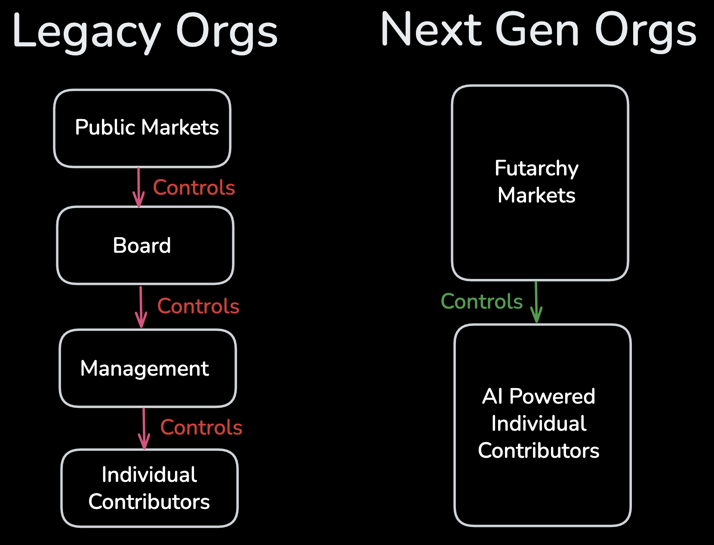

# The Zero-Management Company
The winning companies of the next decade will have just two layers, public futarchy markets and AI-augmented individual contributors, connected by pure price signals.

This is a radical departure from today's model. The average corporation has four layers of decision-making: public markets judge the company, boards oversee strategy, management executes plans, and individual contributors do the work. Each layer adds delay, politics, and information loss.

Look at what we're building:
- **Futarchy Markets**: Continuous decision-making through prediction markets
- **AI-Powered Individual Contributors**: Direct execution based on market signals
Every decision—from feature prioritization to hiring to budgeting—flows through internal markets where anyone can bet on outcomes.

### How Price Signals Replace PowerPoints
In our system, an engineer doesn't pitch a feature to their manager, who pitches it to their VP, who puts it on the roadmap for board approval. They simply submit it to a market.

The organization's collective intelligence—every investor, engineer, designer, and marketer —can now trade on this decision. If the market says yes, resources automatically flow to that engineer. No HiPPO (Highest Paid Person's Opinion).

Here's where it gets radical: we don't stop at first-order metrics. Second-order KPI markets handle everything traditional management thinks only humans can judge:
- "Will this decision improve our engineering culture?"
- "Will this hire increase team velocity?"
Every qualitative judgment becomes a quantitative market.
### Emergent Leadership
"But who's in charge?" The answer is: **whoever the market trusts.**

This system doesn't eliminate leadership; it makes it liquid and accountable. A founder's vision isn't a top-down decree; it's a highly-weighted, tradable position. The market can choose to back a single visionary's high-risk strategy, just as public markets bet on leaders like Musk or Jobs.

The difference? This mandate isn't reviewed once a quarter by a board. It's reviewed every second by the market itself. Leadership is continuously earned through predictive success. The market can "appoint" experts to specific domains, weighting their predictions more heavily, creating a dynamic hierarchy of influence based on proven merit, not a static org chart.
### Open-Book Management: The Manipulation Killer
The classic critique: "Won't people game the markets?" Our answer: radical transparency. In traditional companies, information asymmetry enables politics. In our system, open-book management makes manipulation nearly impossible:
- All positions are visible (though pseudonymous)
- Historical prediction accuracy is tracked and weighted
- Capital flows are transparent
- Market outcomes are automatically audited against reality

When everyone can see everything, markets become remarkably honest. Bad actors are quickly identified by their track records.
### The Individual Contributor Renaissance
For the past two years, the world has been mesmerized by AI's ability to augment the individual worker. A single developer can now build an application in a weekend. A lone marketer can generate a dozen campaigns before lunch. We have supercharged the "coal face," the point of execution where real work gets done.

But this has created a dangerous imbalance. We've given our workers supercars but left them stuck in the traffic jam of a 1970s management structure. The bottleneck is no longer the ability to do; it is the permission to act.

The shy genius who could never sell their ideas to management? If their feature predictions consistently prove correct, the market weights their future bets more heavily. The charismatic bullshitter who climbed the management ladder? Their failed predictions tank their market influence.

But what about essential human functions like mentorship or conflict resolution? These don't disappear; they become market-funded services. Need a dedicated HR function? Propose it: "Will funding a 'Team Health & Conflict Resolution' role for one year increase our developer retention rate?" If the market bets yes, the role is created. Its authority comes not from a hierarchy, but from its continuously proven value to the organization's goals.
### Automating Bureaucracy, Not People
Let's be clear: we're not eliminating value-adding people, but low-value work. The jobs being replaced are those of the human-as-router—the endless meetings for status updates, the political manoeuvring for resources, the decisions-by-committee.
### The Necessary Infrastructure
Making this work requires three core technologies:
1. High-Frequency Decision Markets: Traditional prediction markets are too slow. We need millisecond settlement and automatic execution.
2. AI Integration Layer: Individual contributors need AI agents that can propose, trade, and execute on their behalf.
3. Trustless Settlement Systems: When there's no management to resolve disputes, code must be law. Smart contracts handle everything from resource allocation to outcome verification.

This is what Govex is building—the operating system for the zero-management company.

Stop looking for visionary CEOs. Start trading the markets that make them obsolete.

Join us👉 [@govexdotai](https://x.com/govexdotai)