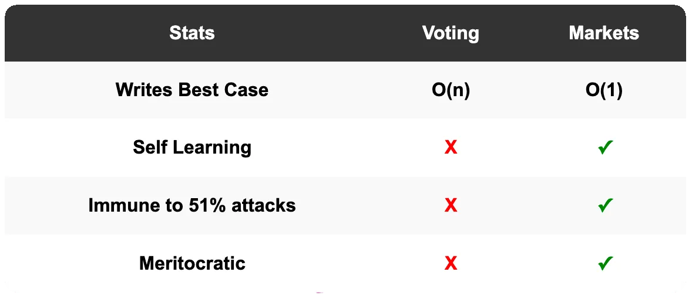
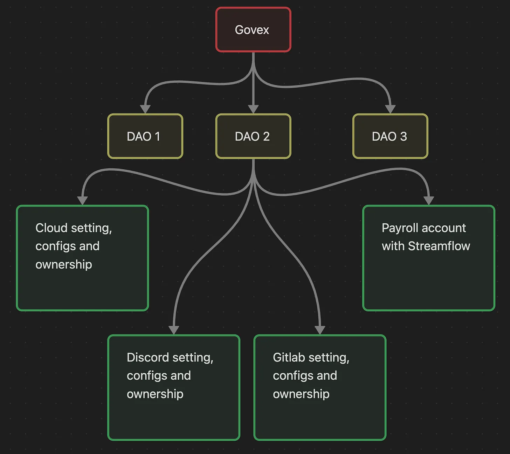

# The Core Value Proposition
Govex offers permissionless markets for decision-making. Good decisions create new value in the world. Futarchic decision markets incentivize good decisions to be presented and actioned. Therefore Govex is the perfect tool for transmutation of wealth-knowledge into wealth. 

Futarchy is a self-reinforcing system. Traders who are better at predicting the impact of proposals, over time, gain more influence. No longer do you need to go to the right Ivy League school, the right golf club, the after-work drinks, or kiss ass for 30 years and then be too old and afraid to make change when you finally get power. Write a doc and let the market decide. 

Futarchy is about to do to the corporation what Bitcoin did to fiat. A Futarchy is analogous to the CEO, the board of directors, and the public markets in one entity. An entity with millisecond latency root access. This is a brand new company structure, a sort of Dutch East India Company, zero to one moment. The Dutch East India Company was the first publicly traded corporation. Interestingly its market cap went to the high [trillions](https://www.businesscompendium.co.uk/post/the-rise-and-fall-of-the-dutch-east-india-company) when adjusted for inflation.

Humans are a eusocial species. Organization and collaboration are everything to us. For thousands of years, we have been using variations of democracy to make key decisions. From a computer science perspective, if we analyze democracy as an algorithm, for a group of N people, N votes are required, or in database terminology, N writes. Any blockchain or database engineer knows that writes are the bottleneck to be optimized. (It's generally good enough for reads to be eventually consistent, so they are cheaper.) We can, therefore, say that democracy has O(N) complexity.

In the best case, with futarchy, if the proposer sets the AMM prices at the right levels, no trading (writes) needs to take place for a decision to pass. It has a best case complexity of O(1). Any software engineer knows no good company will hire you if you use an algorithm with complexity O(N) higher than what is required. I anticipate that, over time, markets will apply discounts to organizations that do not adopt futarchy. This is the [founder trade](https://hbr.org/2016/03/founder-led-companies-outperform-the-rest-heres-why) of the next couple of decades.

_A table comparing voting and futarchic markets._

Markets facilitate the natural pattern of human [coordination](https://en.wikipedia.org/wiki/1%25_rule). Only a small minority are highly informed and willing to be regularly active. While due to the O(N) cost of voting, votes can only be held sporadically. This creates a stale signal, that for many organizations, can be one to five years out of date. Furthermore, voting assumes there is no useful signal from previous votes. Markets, as Friedrich Hayek famously [argued](https://philosophicaldisquisitions.blogspot.com/2016/11/understanding-hayeks-knowledge-argument.html) are primarily an information compression and discovery mechanism. The price mutates over time in response to new information and preferences etc. 

Furthermore, a critical distinction lies in their capacity to represent the full spectrum of belief. Voting systems, even sophisticated forms like quadratic voting, primarily quantify the cumulative magnitude of positive preference. They excel at aggregating how much support exists for various options. However, they intrinsically lack a direct mechanism to capture or incentivize the expression of the 'negative realm'—the conviction that a proposal is flawed, detrimental, or overvalued. Futarchic markets, in stark contrast, provide symmetrical pathways: participants can not only 'long' (support) a proposal but can also 'short' (bet against) it, thereby actively incorporating and incentivizing the articulation of dissent and the correction of potential errors.

Markets compress all information about a company into a single number. Futarchy is an ownership compression mechanism. Futarchy compresses a company's property rights into a single key. Futarchy will unlock the financialization of new types of state. State that was originally isolated in web2 will now be composable, readable, writable, and executable within Turing-complete operations. All state will be governed or encapsulated by the Govex platform. All companies will have their assets governed by the Govex platform, in an upside-down tree-like hierarchy. To facilitate this the entire web2 SAAS industry will rewrite how their account configs are governed and controlled. AWS, Discord, Google Suite, etc.

# Govex Novel Use Cases
### Heterogeneous ETFs

Imagine I have $10 and I want to get exposure to the general returns of the classic whiskey or car market. Onchain each bottle or car can be represented as a hybrid SPL404 NFT. Investors can gain exposure by purchasing the hybrid fungible tokens, without needing to buy an integer number of bottle or car ownership NFTs.

Any amount of money can now track the returns of the entire sector. And even generate a small fee from holding the SPL404 tokens. In contrast to the 0.1% to 0.4% fee holders have to pay to index managers today. This also increases liquidity for borrowing against and getting into and out of positions.

The index will be governed as a futarchy. Investors can buy out of and sell into the ETF. The price of these transactions will be determined by a futarchic market to ensure they mint or burn a fair number of the hybrid tokens in exchange for a given NFT being added to or removed from the index.
### The V2 Oracle
If prediction markets are a truth machine that makes Govex an oracle project.

I view a futarchy as a V2 oracle. Futarchies are self-resolving and natural language compatible. Futarchies don't rely on the economic security of external oracle chains. Futarchies are protected by 'proof of positive expected value'. Futarchies can be used to verify the completion of imprecise and unconstrained or hard-to-verify intents or disputes.

### The Composable Standard for Organization Governance
When the majority of Orgs are on the Govex protocol, there will be addiitonal [network benefits](https://en.wikipedia.org/wiki/Metcalfe%27s_law) unlocked. Organizations will be able to create atomic interdependant cross-organization proposals.